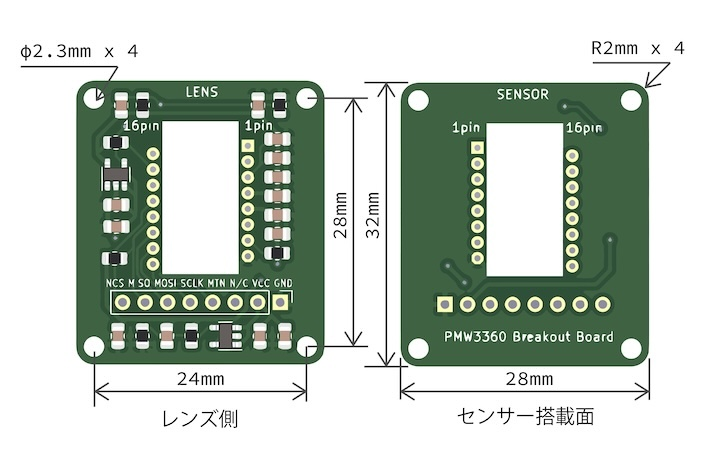
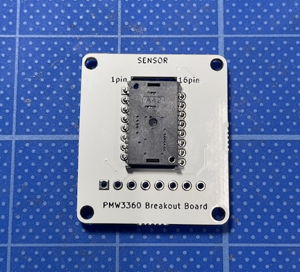
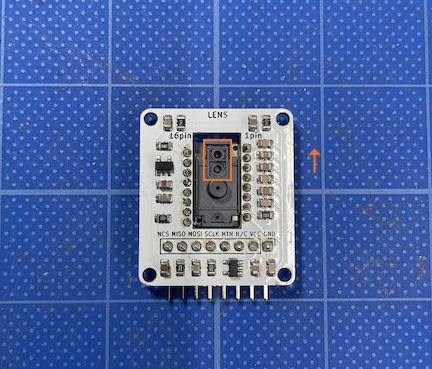
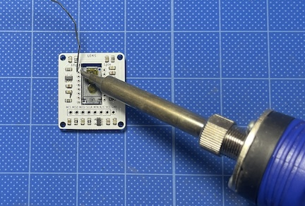
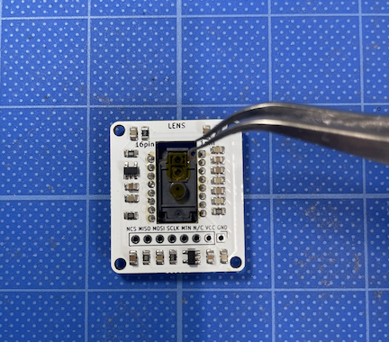
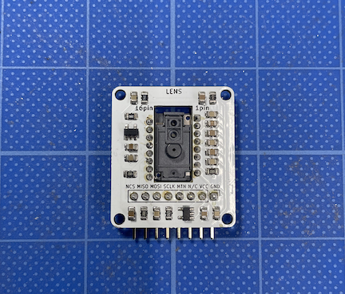
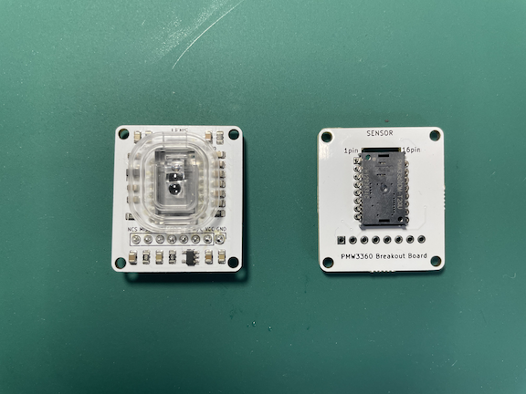

# PMW3360 breakout board

このリポジトリには、PIXART社製のPMW3360DM-T2QU光学式マウスセンサー用のBreakoutボードのデザインファイルが含まれています。

このキットは、トラックボール付きキーボード、マウス、トラックボールをDIYで自作するために使用できます。
レギュレーターが搭載されているので、5Vでも3.3Vでも使えます。
QMK等のソフトウェアでSPI通信のピン番号を設定することで、ご使用いただけます。

センサーチップはSENSOR側にあり、部品が実装されている側はLENS側です。センサーとピンヘッダはご自身でハンダ付けする必要があります。

基板サイズは28x32mm、M2ネジ用の取り付け穴はφ2.3mm、24x28mmです。 

### 寸法図

### ピン番号
|1|2|3|4|5|6|7|8|
|-|-|-|-|-|-|-|-|
|CS|MISO|MOSI|SCLK|MOTION|N/C|VCC|GND|

### キットに含まれるもの
- PMW3360DM-T2QU　1個
- LM19-LSI（LENS）1個
- ブレイクアウトボード　1個

### 別売ユニット
- トラックボール
- ピンヘッダ

### 設計データ
- [回路図](https://github.com/monkeypad/pmw3360-breakout/blob/main/pcb/pmw3360.pdf)

トラックボールキーボード、マウスを設計される際はクリアランスに注意してください。レンズ面から対象物まで2.4mm程度のクリアランスが必要です。詳細はメーカーのDatasheet P6 - P10をご確認ください。
- [Datasheet](https://d3s5r33r268y59.cloudfront.net/datasheets/9604/2017-05-07-18-19-11/PMS0058-PMW3360DM-T2QU-DS-R1.50-26092016._20161202173741.pdf)

### 手順
1.SENSOR側の面にセンサーを搭載する

  
  

2.LENS側の面をハンダづけする

 

3.LENSのフィルムをピンセットで剥がす

  

4.ピンヘッダをハンダづけして完了

  

5.レンズ搭載

  
