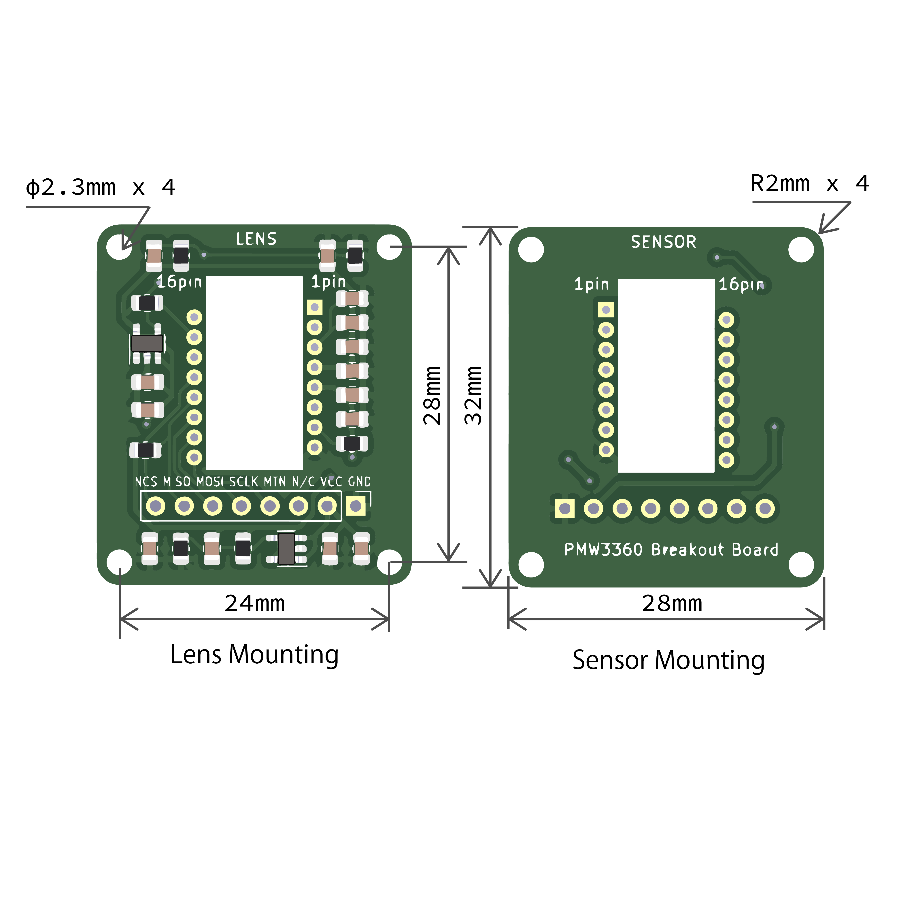

# PMW3360 breakout board

This repository contains PCB design files for an optical sensor PIXART PMW3360 and a breakout board, a company popular for self-made keyboards and self-made mice.

This board can be used for making your DIY keyboard with trackball, mouse, or trackball.
This board is equipped with a regulator, so either 5V or 3.3V logic can be used.

The sensor chip is on the SENSOR side, and the side where the components are mounted is on the LENS side. Customers need to solder the sensor and pin headers.

The board size is 28x32mm and the mounting holes are 24x28mm for M2 screws.

