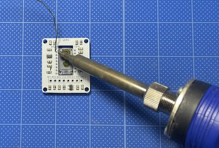

# PMW3360 Breakout Board

This repository contains the design files for a breakout board for the PIXART PMW3360DM-T2QU optical mouse sensor.

This kit can be used to DIY assemble a keyboard with a trackball, a mouse, or a standalone trackball. It includes a regulator, allowing it to be used with both 5V and 3.3V power supplies. By configuring the SPI communication pin numbers in software such as QMK, you can customize its functionality to suit your needs.

The sensor chip is located on the SENSOR side, and the side with the components installed is the LENS side. You will need to solder the sensor and pin headers yourself.

The board dimensions are 28x32mm, with mounting holes for M2 screws at φ2.3mm and 24x28mm.

### Dimensions Diagram

### Pinout
| 1 | 2 | 3 | 4 | 5 | 6 | 7 | 8 |
|---|---|---|---|---|---|---|---|
| CS | MISO | MOSI | SCLK | MOTION | N/C | VCC | GND |

### Kit Contents
- PMW3360DM-T2QU Sensor x 1
- LM19-LSI (Lens) x 1
- Breakout Board x 1

### Sold Separately
- Trackball
- Pin Headers

### Design Files
- [Schematic](https://github.com/monkeypad/pmw3360-breakout/blob/main/pcb/pmw3360.pdf)

When designing a trackball keyboard or mouse, pay attention to clearance. A clearance of approximately 2.4mm is required from the lens surface to the target object. For more details, refer to the manufacturer's Datasheet pages P6 - P10.
- [Datasheet](https://d3s5r33r268y59.cloudfront.net/datasheets/9604/2017-05-07-18-19-11/PMS0058-PMW3360DM-T2QU-DS-R1.50-26092016._20161202173741.pdf)

### Assembly Instructions
1. **Mount the Sensor on the SENSOR Side**

      
      
    
2. **Solder the LENS Side**

     

3. **Remove the Lens Film with Tweezers**

      
    
4. **Solder the Pin Headers and Complete**

      
    
5. **Attach the Lens**

      
