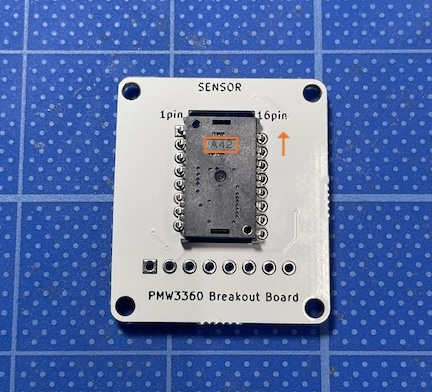
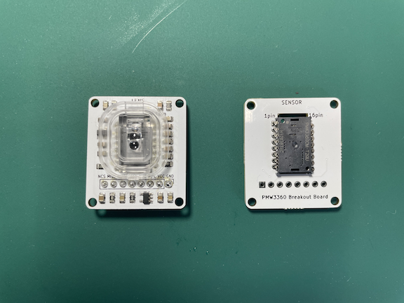

# PMW3360 breakout board

This repository includes design files for a breakout board for the PIXART PMW3360DM-T2QU optical mouse sensor.

This kit can be used to build a DIY trackball keyboard, mouse, or trackball. It is versatile for use with either 5V or 3.3V, thanks to the integrated regulator. By configuring SPI communication pin numbers in software like QMK, you can easily integrate it into your projects.

The sensor chip is located on the SENSOR side, while the side with implemented components is the LENS side. You will need to solder the sensor and pin headers yourself.

The board dimensions are 28x32mm, with mounting holes for M2 screws measuring φ2.3mm. The overall dimensions of the board are 24x28mm.

### Dimensions

### Pin Configuration
|1|2|3|4|5|6|7|8|
|-|-|-|-|-|-|-|-|
|CS|MISO|MOSI|SCLK|MOTION|N/C|VCC|GND|

### Included in the Kit
・PMW3360DM-T2QU　1 pc 
・LM19-LSI（LENS）1 pc 
・Breakout board 1 pc 

### Optional Units (not included)
・Trackball 1 pc 
・8 pin header 

### Design Data
- [Circuit Diagram](https://github.com/monkeypad/pmw3360-breakout/blob/main/pcb/pmw3360.pdf)

When designing a trackball keyboard or mouse, please pay attention to clearance. Approximately 2.4mm of clearance from the lens surface to the target object is required. For detailed information, refer to the manufacturer's Datasheet P6 - P10.

- [Datasheet](https://d3s5r33r268y59.cloudfront.net/datasheets/9604/2017-05-07-18-19-11/PMS0058-PMW3360DM-T2QU-DS-R1.50-26092016._20161202173741.pdf)

### Procedure

1.Mount the sensor on the SENSOR side.

  

2.Solder the LENS side.

 

3.Peel off the film from the LENS using tweezers.

  

4.Solder the pin header to complete the assembly.

  

5.Mount the lens.

  

